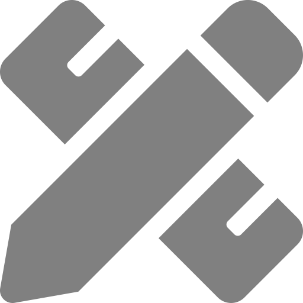

---
author-meta:
- Nicole Vasilevsky
- Mohammad Hosseini
- Samantha Teplitzky
- Violeta Ilik
- Ehsan Mohammadi
- Juliane Schneider
- Barbara Kern
- Julien Colomb
- Scott Edmunds
- Karen Gutzman
- Daniel Himmelstein
- Marijane White
- Britton Smith
- Lisa O'Keefe
- Melissa Haendel
- Kristi Holmes
bibliography:
- content/manual-references.json
date-meta: '2020-07-21'
header-includes: "<!--\nManubot generated metadata rendered from header-includes-template.html.\nSuggest improvements at https://github.com/manubot/manubot/blob/master/manubot/process/header-includes-template.html\n-->\n<meta name=\"dc.format\" content=\"text/html\" />\n<meta name=\"dc.title\" content=\"Major challenges on authorship and concept of authorship - why is something more needed on contributorship?\" />\n<meta name=\"citation_title\" content=\"Major challenges on authorship and concept of authorship - why is something more needed on contributorship?\" />\n<meta property=\"og:title\" content=\"Major challenges on authorship and concept of authorship - why is something more needed on contributorship?\" />\n<meta property=\"twitter:title\" content=\"Major challenges on authorship and concept of authorship - why is something more needed on contributorship?\" />\n<meta name=\"dc.date\" content=\"2020-07-21\" />\n<meta name=\"citation_publication_date\" content=\"2020-07-21\" />\n<meta name=\"dc.language\" content=\"en-US\" />\n<meta name=\"citation_language\" content=\"en-US\" />\n<meta name=\"dc.relation.ispartof\" content=\"Manubot\" />\n<meta name=\"dc.publisher\" content=\"Manubot\" />\n<meta name=\"citation_journal_title\" content=\"Manubot\" />\n<meta name=\"citation_technical_report_institution\" content=\"Manubot\" />\n<meta name=\"citation_author\" content=\"Nicole Vasilevsky\" />\n<meta name=\"citation_author_institution\" content=\"Oregon Clinical and Translational Research Institute, Oregon Health &amp; Science University\" />\n<meta name=\"citation_author_institution\" content=\"Department of Medical Informatics and Clinical Epidemiology, Oregon Health &amp; Science University\" />\n<meta name=\"citation_author_orcid\" content=\"0000-0001-5208-3432\" />\n<meta name=\"twitter:creator\" content=\"@n_vasilevsky\" />\n<meta name=\"citation_author\" content=\"Mohammad Hosseini\" />\n<meta name=\"citation_author_institution\" content=\"Dublin City University\" />\n<meta name=\"citation_author_orcid\" content=\"0000-0002-2385-985X\" />\n<meta name=\"citation_author\" content=\"Samantha Teplitzky\" />\n<meta name=\"citation_author_institution\" content=\"University of California, Berkeley\" />\n<meta name=\"citation_author_orcid\" content=\"0000-0001-7071-332X\" />\n<meta name=\"citation_author\" content=\"Violeta Ilik\" />\n<meta name=\"citation_author_institution\" content=\"Library, Columbia University\" />\n<meta name=\"citation_author_orcid\" content=\"0000-0003-2588-3084\" />\n<meta name=\"citation_author\" content=\"Ehsan Mohammadi\" />\n<meta name=\"citation_author_institution\" content=\"University of South Carolina\" />\n<meta name=\"citation_author_orcid\" content=\"0000-0003-3481-6991\" />\n<meta name=\"citation_author\" content=\"Juliane Schneider\" />\n<meta name=\"citation_author_institution\" content=\"Harvard University\" />\n<meta name=\"citation_author_orcid\" content=\"0000-0002-7664-3331\" />\n<meta name=\"citation_author\" content=\"Barbara Kern\" />\n<meta name=\"citation_author_institution\" content=\"University of Chicago\" />\n<meta name=\"citation_author_orcid\" content=\"0000-0002-1184-911X\" />\n<meta name=\"citation_author\" content=\"Julien Colomb\" />\n<meta name=\"citation_author_institution\" content=\"Humboldt-Universit\xE4t zu Berlin, SFB1315, Institut f\xFCr Biologie, Charit\xE9platz 1, 10117 Berlin\" />\n<meta name=\"citation_author_orcid\" content=\"0000-0002-3127-5520\" />\n<meta name=\"citation_author\" content=\"Scott Edmunds\" />\n<meta name=\"citation_author_institution\" content=\"GigaScience\" />\n<meta name=\"citation_author_orcid\" content=\"0000-0001-6444-1436\" />\n<meta name=\"citation_author\" content=\"Karen Gutzman\" />\n<meta name=\"citation_author_institution\" content=\"Galter Health Sciences Library and Learning Center, Northwestern University Feinberg School of Medicine\" />\n<meta name=\"citation_author_orcid\" content=\"0000-0001-6331-4451\" />\n<meta name=\"citation_author\" content=\"Daniel Himmelstein\" />\n<meta name=\"citation_author_institution\" content=\"University of Pennsylvania\" />\n<meta name=\"citation_author_orcid\" content=\"0000-0002-3012-7446\" />\n<meta name=\"citation_author\" content=\"Marijane White\" />\n<meta name=\"citation_author_institution\" content=\"Library, Oregon Health &amp; Science University\" />\n<meta name=\"citation_author_orcid\" content=\"0000-0001-5059-4132\" />\n<meta name=\"citation_author\" content=\"Britton Smith\" />\n<meta name=\"citation_author_institution\" content=\"University of Edinburgh\" />\n<meta name=\"citation_author_orcid\" content=\"0000-0002-6804-630X\" />\n<meta name=\"citation_author\" content=\"Lisa O&#39;Keefe\" />\n<meta name=\"citation_author_institution\" content=\"Galter Health Sciences Library and Learning Center, Northwestern University Feinberg School of Medicine\" />\n<meta name=\"citation_author\" content=\"Melissa Haendel\" />\n<meta name=\"citation_author_institution\" content=\"Oregon Clinical and Translational Research Institute, Oregon Health &amp; Science University\" />\n<meta name=\"citation_author_institution\" content=\"Linus Pauling Institute, Oregon State University\" />\n<meta name=\"citation_author_orcid\" content=\"0000-0001-9114-8737\" />\n<meta name=\"citation_author\" content=\"Kristi Holmes\" />\n<meta name=\"citation_author_institution\" content=\"Department of Preventive Medicine, Northwestern University Feinberg School of Medicine\" />\n<meta name=\"citation_author_institution\" content=\"Galter Health Sciences Library and Learning Center, Northwestern University Feinberg School of Medicine\" />\n<meta name=\"citation_author_orcid\" content=\"0000-0001-8420-5254\" />\n<link rel=\"canonical\" href=\"https://data2health.github.io/contributorship/\" />\n<meta property=\"og:url\" content=\"https://data2health.github.io/contributorship/\" />\n<meta property=\"twitter:url\" content=\"https://data2health.github.io/contributorship/\" />\n<meta name=\"citation_fulltext_html_url\" content=\"https://data2health.github.io/contributorship/\" />\n<meta name=\"citation_pdf_url\" content=\"https://data2health.github.io/contributorship/manuscript.pdf\" />\n<link rel=\"alternate\" type=\"application/pdf\" href=\"https://data2health.github.io/contributorship/manuscript.pdf\" />\n<link rel=\"alternate\" type=\"text/html\" href=\"https://data2health.github.io/contributorship/v/97717744239208b4fe802fc00198fa96fb67e036/\" />\n<meta name=\"manubot_html_url_versioned\" content=\"https://data2health.github.io/contributorship/v/97717744239208b4fe802fc00198fa96fb67e036/\" />\n<meta name=\"manubot_pdf_url_versioned\" content=\"https://data2health.github.io/contributorship/v/97717744239208b4fe802fc00198fa96fb67e036/manuscript.pdf\" />\n<meta property=\"og:type\" content=\"article\" />\n<meta property=\"twitter:card\" content=\"summary_large_image\" />\n<link rel=\"icon\" type=\"image/png\" sizes=\"192x192\" href=\"https://manubot.org/favicon-192x192.png\" />\n<link rel=\"mask-icon\" href=\"https://manubot.org/safari-pinned-tab.svg\" color=\"#ad1457\" />\n<meta name=\"theme-color\" content=\"#ad1457\" />\n<!-- end Manubot generated metadata -->"
keywords:
- authorship
- contributorship
- force11
- publishing
- manubot
lang: en-US
manubot-clear-requests-cache: false
manubot-output-bibliography: output/references.json
manubot-output-citekeys: output/citations.tsv
manubot-requests-cache-path: ci/cache/requests-cache
title: Major challenges on authorship and concept of authorship - why is something more needed on contributorship?
...

<small><em>
This manuscript
([permalink](https://data2health.github.io/contributorship/v/97717744239208b4fe802fc00198fa96fb67e036/))
was automatically generated
from [data2health/contributorship@9771774](https://github.com/data2health/contributorship/tree/97717744239208b4fe802fc00198fa96fb67e036)
on July 21, 2020.
</em></small>

## Authors

+ **Nicole Vasilevsky** 
    {.inline_icon}
    [0000-0001-5208-3432](https://orcid.org/0000-0001-5208-3432)
    · {.inline_icon}
    [nicolevasilevsky](https://github.com/nicolevasilevsky)
    · {.inline_icon}
    [n_vasilevsky](https://twitter.com/n_vasilevsky)
    · {.inline_icon}
    <a title="CREDIT_00000001 conceptualization role
CRO_0000081 coordination role
CREDIT_00000002 data curation role
CRO_0000052 standards role
CREDIT_00000013 writing original draft role">5 roles</a>
   
  <small>
     Oregon Clinical and Translational Research Institute, Oregon Health & Science University; Department of Medical Informatics and Clinical Epidemiology, Oregon Health & Science University
     · Funded by Grant# NCATS U24TR002306
  </small>

+ **Mohammad Hosseini** 
    {.inline_icon}
    [0000-0002-2385-985X](https://orcid.org/0000-0002-2385-985X)
    · {.inline_icon}
    <a title="CREDIT_00000013 writing original draft role
CREDIT_00000001 conceptualization role">2 roles</a>
   
  <small>
     Dublin City University
  </small>

+ **Samantha Teplitzky** 
    {.inline_icon}
    [0000-0001-7071-332X](https://orcid.org/0000-0001-7071-332X)
    · {.inline_icon}
    [samteplitzky](https://github.com/samteplitzky)
    · {.inline_icon}
    <a title="CREDIT_00000013 writing original draft role
CREDIT_00000001 conceptualization role">2 roles</a>
   
  <small>
     University of California, Berkeley
  </small>

+ **Violeta Ilik** 
    {.inline_icon}
    [0000-0003-2588-3084](https://orcid.org/0000-0003-2588-3084)
    · {.inline_icon}
    [vioil](https://github.com/vioil)
    · {.inline_icon}
    <a title="CREDIT_00000013 writing original draft role
CREDIT_00000002 data curation role
CREDIT_00000001 conceptualization role">3 roles</a>
   
  <small>
     Library, Columbia University
  </small>

+ **Ehsan Mohammadi** 
    {.inline_icon}
    [0000-0003-3481-6991](https://orcid.org/0000-0003-3481-6991)
    · {.inline_icon}
    <a title="CREDIT_00000013 writing original draft role">1 role</a>
   
  <small>
     University of South Carolina
  </small>

+ **Juliane Schneider** 
    {.inline_icon}
    [0000-0002-7664-3331](https://orcid.org/0000-0002-7664-3331)
    · {.inline_icon}
    [pitviper6](https://github.com/pitviper6)
    · {.inline_icon}
    <a title="CREDIT_00000013 writing original draft role
CREDIT_00000002 data curation role">2 roles</a>
   
  <small>
     Harvard University
  </small>

+ **Barbara Kern** 
    {.inline_icon}
    [0000-0002-1184-911X](https://orcid.org/0000-0002-1184-911X)
    · {.inline_icon}
    <a title="CREDIT_00000013 writing original draft role">1 role</a>
   
  <small>
     University of Chicago
  </small>

+ **Julien Colomb** 
    {.inline_icon}
    [0000-0002-3127-5520](https://orcid.org/0000-0002-3127-5520)
    · {.inline_icon}
    <a title="CREDIT_00000013 writing original draft role
CREDIT_00000009 sotware role
CREDIT_00000001 conceptualization role">3 roles</a>
   
  <small>
     Humboldt-Universität zu Berlin, SFB1315, Institut für Biologie, Charitéplatz 1, 10117 Berlin
     · Funded by The German Research Foundation, Grant Number 327654276: SFB 1315
  </small>

+ **Scott Edmunds** 
    {.inline_icon}
    [0000-0001-6444-1436](https://orcid.org/0000-0001-6444-1436)
    · {.inline_icon}
    <a title="CREDIT_00000013 writing original draft role
CREDIT_00000001 conceptualization role">2 roles</a>
   
  <small>
     GigaScience
  </small>

+ **Karen Gutzman** 
    {.inline_icon}
    [0000-0001-6331-4451](https://orcid.org/0000-0001-6331-4451)
    · {.inline_icon}
    <a title="CREDIT_00000013 writing original draft role
CRO_0000006 background and literature search role">2 roles</a>
   
  <small>
     Galter Health Sciences Library and Learning Center, Northwestern University Feinberg School of Medicine
     · Funded by Grant# UL1TR001422
  </small>

+ **Daniel Himmelstein** 
    {.inline_icon}
    [0000-0002-3012-7446](https://orcid.org/0000-0002-3012-7446)
    · {.inline_icon}
    [dhimmel](https://github.com/dhimmel)
    · {.inline_icon}
    <a title="CREDIT_00000009 software role
CRO_0000064 software engineering role">2 roles</a>
   
  <small>
     University of Pennsylvania
  </small>

+ **Marijane White** 
    {.inline_icon}
    [0000-0001-5059-4132](https://orcid.org/0000-0001-5059-4132)
    · {.inline_icon}
    <a title="CRO_0000052 standards role">1 role</a>
   
  <small>
     Library, Oregon Health & Science University
     · Funded by Grant# U24 TR002306
  </small>

+ **Britton Smith** 
    {.inline_icon}
    [0000-0002-6804-630X](https://orcid.org/0000-0002-6804-630X)
    · {.inline_icon}
    <a title="CREDIT_00000001 conceptualization role">1 role</a>
   
  <small>
     University of Edinburgh
  </small>

+ **Lisa O'Keefe** 
    · {.inline_icon}
    <a title="CRO_0000081 coordination role">1 role</a>
   
  <small>
     Galter Health Sciences Library and Learning Center, Northwestern University Feinberg School of Medicine
  </small>

+ **Melissa Haendel** 
    {.inline_icon}
    [0000-0001-9114-8737](https://orcid.org/0000-0001-9114-8737)
    · {.inline_icon}
    [mellybelly](https://github.com/mellybelly)
    · {.inline_icon}
    <a title="CREDIT_00000013 writing original draft role
CRO_0000052 'standards role'
CREDIT_00000002 ‘data curation role’
CREDIT_00000004 'funding acquisition role'">4 roles</a>
   
  <small>
     Oregon Clinical and Translational Research Institute, Oregon Health & Science University; Linus Pauling Institute, Oregon State University
     · Funded by Grant# NCATS U24TR002306
  </small>

+ **Kristi Holmes** 
    {.inline_icon}
    [0000-0001-8420-5254](https://orcid.org/0000-0001-8420-5254)
    · {.inline_icon}
    [kristiholmes](https://github.com/kristiholmes)
    · {.inline_icon}
    <a title="CRO_0000081 coordination role
CREDIT_00000013 writing original draft role
CREDIT_00000002 data curation role
CRO_0000052 standards role
CREDIT_00000001 conceptualization role
CREDIT_00000004 funding acquisition role">6 roles</a>
   
  <small>
     Department of Preventive Medicine, Northwestern University Feinberg School of Medicine; Galter Health Sciences Library and Learning Center, Northwestern University Feinberg School of Medicine
     · Funded by Grant# U24TR002306, UL1TR001422
  </small>

# Is authorship sufficient for today’s collaborative research? A call for contributor roles

## Authors: 
Nicole A. Vasilevsky,1, Mohammad Hosseini,2, Samantha Teplitzky3, Violeta Ilik4, Ehsan Mohammadi5, Juliane Schneider6, Barbara Kern7, Julien Colomb8, Scott C. Edmunds9, Karen Gutzman10, Daniel S. Himmelstein11, Marijane White12, Britton Smith13, Lisa O’Keefe10, Melissa Haendel1, Kristi L. Holmes10, 14

1 Oregon Clinical & Translational Research Institute, Oregon Health & Science University, Portland, OR, USA  
2 Institute of Ethics, School of Theology, Philosophy and Music, Dublin City University, Dublin, Ireland  
3 Library, University of California, Berkeley, CA, USA  
4 Adelphi University, Garden City, NY, USA  
5 School of Library and Information Science College of Information and Communications, University of South Carolina, Columbia, SC, USA  
6  Clinical and Translational Science Center, Harvard University, Cambridge, MA, USA  
7 The John Crerar Library, University of Chicago, Chicago, IL, USA  
8  Institute of Biology, Humboldt-Universität zu Berlin, Berlin, Germany  
9 GigaScience, BGI Hong Kong, Shek Mun, Hong Kong  
10 Galter Health Sciences Library and Learning Center, Northwestern University Feinberg School of Medicine, Chicago, IL, USA  
11 Department of Systems Pharmacology and Translational Therapeutics, University of Pennsylvania, Philadelphia, PA, USA  
12 Library, Oregon Health & Science University, Portland, OR, USA  
13 School of Physics and Astronomy, University of Edinburgh, Edinburgh, UK  
14 Department of Preventive Medicine, Northwestern University Feinberg School of Medicine, Chicago, IL, USA  

## Abstract

Assigning authorship and recognizing contributions to scholarly works is challenging on many levels. Here we discuss ethical, social, and technical challenges to the concept of authorship that may impede the recognition of contributions to a scholarly work. Recent work in the field of authorship shows that  shifting to a more inclusive contributorship approach may address these challenges. Recent efforts to enable better recognition of contributions to scholarship include the development of the Contributor Role Ontology (CRO), which extends the CRediT taxonomy and can be used in information systems for structuring contributions. We also introduce the Contributor Attribution Model (CAM), which provides a simple data model that relates the contributor to research objects via the role that they played, as well as the provenance of the information. Finally, requirements for adoption of a contributorship-based approach are discussed.

## Introduction
### Background perspectives on authorship
Scholarly authorship generally consists of publishing academic findings in journal articles, book chapters, and monographs (Shamoo and Resnik 2015). In academic collaborations within science and engineering, where co-authorship is the norm, authorship status is attributed to those who have made a significant contribution to certain tasks within the project (Borenstein and Shamoo 2015). Beyond being used as an instrument to recognize contributions, authorship is also used to hold contributors accountable for the accuracy and integrity of published claims (McNutt et al. 2018).

Receiving recognition through authorship has long been entrenched as a reward in the scholarly realm. Even so, it has long been acknowledged that assigning authorship credit is neither a fair nor uniform process (Heffner 08/1979). Historically, concerns about authorship credit centered around awarding authorship to those who did not deserve it, and consequently diminishing the contributions of the first, or primary authors. Terms such as profligate, honorary, and courtesy authorship describe various forms of authorship abuse. Some of the proposed solutions to address these problems include defining criteria for authorship (e.g. by the Vancouver group since 1987), providing details of contributions (Moulopoulos, Sideris, and Georgilis 1983), and assigning a rating to authors’ efforts (Stamler 1979). These solutions often stemmed from a desire to narrow the criteria for authorship, and to clarify roles or the extent of contributions to prevent awarding author status to those who did not deserve it. Nevertheless, applying these solutions in practice may contribute to other tensions. 

| Assigning authorship credit can easily go awry, damaging the reputation of authors, institutions, journals and science in general, as exemplified in (Deacon et al. 09/2017) where a published work was retracted because of an authorship dispute. Ongoing questions also persist across disciplines regarding credit for the staff who performed most, if not all experiments that lead to knowledge and breakthroughs, as demonstrated in the debate on "Who really made Dolly?" in the Guardian (Sample 2006): “You get some papers where the authors haven't done a scrap of work themselves, it's all down to the technicians acknowledged at the back.” Occasionally disputes over authorship can lead to retractions, as shown in (Wager and Williams 2011) that found that “[a]rticles with single authors included a higher proportion retracted because of disputed authorship (5/29=17%)."|
|:-------------------------------------------------------------------------------------------------|

Modern research is interdisciplinary, reflecting a team approach where the skills needed to conduct reliable research are often specialized (Gibbons 1994). In this dynamic where various contribution-types are required, revamping our understanding of authorship, credit, and recognition of individual efforts in academia seems necessary (Larivière et al. 06/2016). Rather than coming from a place of censure, we propose a continuum in which contributions from a team of people could be welcomed and recognized.

## Challenges of authorship 
### Ethical challenges 
As authorship remains the single most important form of recognition of individual contributions, tensions around its definition and enforcement remain challenging to address. Many guidelines such as those provided by the Council of Science Editors (Council of Science Editors 2012) and The International Committee of Medical Journal Editors (ICMJE) (International Committee of Medical Journal Editors. 2019) suggest that authors should have made a ‘significant contribution’ to the study. Nevertheless, what constitutes a ‘significant contribution’ is ambiguous and difficult to formally define (Street et al. 5/2010). Because a relaxed attitude towards authorship criteria might lead to inflated bylines and hyperauthorship (Cronin 2001), the authorship paradigm seems unsuitable to recognize non-standard, but essential contributions like dataset management, software and protocol development (Haendel 2016 (Uijtdehaage, Mavis, and Durning 08/2018).

While modern research needs the participation of a range of contributors, in recent decades a steady increase in the average number of co-authors per publication (Larivière et al. 07/2015) has contributed to major ethical issues. For instance, in the presence of more co-authors, addressing ethical challenges in the distribution of authorship, acknowledgment credit (Smith and Master 2017), ensuring that co-authors meet authorship criteria (Hwang et al. 2003), and handling authorship order (Strange 09/2008) would be more challenging. Similarly, with more authors in the byline, ambiguities in relation to individual and shared responsibilities are much more pronounced (Shapiro 1994). As such, questions about the attribution of authorship status to various contributors remain difficult to answer. For example, it is not clear whether Principal Investigators always deserve authorship status (Maggio et al. 12/2019) or if contributions from graduate students, research technicians, project/program managers, and core lab scientists merit authorship. Moreover, the role of non-academic contributors such as citizen scientists (Gadermaier et al. 2018); (Ward-Fear et al. 12/2019) and community-based partnerships seems difficult to recognize (Castleden, Morgan, and Neimanis 2010). Within interdisciplinary projects, other issues such as dissimilar norms in the distribution of authorship credit and author’s order may be present as well. Some fields list authors in alphabetical order and others based on the degree of contribution. It is common in certain disciplines, such as physics, to have hundreds of authors on a paper, whereas in other fields like humanities, one or very few authors may contribute to publications.

### Social challenges and Authorship Criteria
Authorship practices have real consequences, as observed when applying authorship credit for tenure and promotion or when allocating funding (Laccourreye and Rubin 2018; Kaufmann et al. 2010). While distribution of authorship credit is not straightforward, similar principles and standards are suggested for articles involving one or two individuals or articles involving  hundreds or thousands of contributors (Fontanarosa, Bauchner, and Flanagin 2017). To mitigate tensions, it is often advised that roles and duties of individuals should be agreed upon and discussed at the outset of a study (Smith and Master 2017). However, this can be a challenge as research personnel and the work may change over the course of a project. Furthermore, in most cases explicit discussions about awarding credit occur in response to issues that arise, hence, minimizing the usefulness of discussions (Bozeman and Youtie 2016). 

|Longer authorship lists complicate measuring individual contributions (Sandler and Russell 04/2005), further disincentivizing authorship practices that recognize more than the most involved researchers on a project.|
|:-----|

Additionally, the participation of junior and senior contributors with unequal authority and institutional influence, contribute to other forms of authorship abuse (Andes and Mabrouk 2018). “Honorary” and “gift” authorship, involve “naming as an author, an individual who does not meet authorship criteria” (Flanagin 1998). In severe cases, individuals are listed without having made any contributions and are included as authors to add perceived prestige or credibility to the research (Street et al. 5/2010). In contrast, sometimes it is the lack of giving due credit to those who deserve it (so-called ghost authorship) that raises concerns. Junior scholars or researchers from the industry who made notable contributions to a project are among common ghost-authors (Gøtzsche et al. 2007; Bavdekar 2012). 

Gender disparity in the distribution of authorship credit is another social challenge. Underrepresentation and lower visibility of women in publications is reported in male-dominate research areas such as Computer Sciences (Wang et al. 2019), Political Sciences (H. Williams et al. 2015), and Neurosurgery (Sotudeh, Dehdarirad, and Freer 2018). Even in fields such as Higher Education where the gender composition of scholars is more balanced, gender inequity is still noticeable (E. A. Williams et al. 2018). Women publish fewer articles, and when they do publish, they are less likely to occupy important positions of the byline such as first or last positions, and attract fewer citations (Bendels et al. 2018). This trend continues in the COVID-19 era where women are reported to be publishing less during the pandemic (Viglione 2020). When it comes to contribution types and labor roles, women with varying experience in academics are often performing experiments, which are associated with academically younger scholars (Macaluso et al. 2016). Even in cases where authors made equal contributions, female authors are often not listed as first authors (Broderick and Casadevall 2019).

There are a number of guidelines on authorship and scholarly works. In 1985 the International Committee of Medical Journal Editors (ICMJE) outlined guidelines on authorship, which have evolved and been updated since (International Committee of Medical Journal Editors. 2019). The ICMJE lists specific criteria that must be met for authorship including conceptualization of the work, acquisition or analysis or interpretation of the data, drafting the text, approval of the draft, and responsibility for the published content. With respect to authorship versus contributorship, the ICMJE classifies project members who do not participate in the four authorship criteria above as “non-author contributors”. This approach works for authorship decisions, for the most part, however it can fail for example if one makes “substantial contributions to the conception or design of the work; or the acquisition, analysis, or interpretation of data for the work but they are not included in drafting the work or revising it critically for important intellectual content” (“ICMJE | Recommendations | Defining the Role of Authors and Contributors” n.d.). The guidelines describe work that alone qualify a contributor for authorship, such as acquisition of funding, leadership of a research group, administrative support, and writing support. The ICMJE recommends that such non-author contributors be acknowledged and their contributions to the work specified. In addition to the ICMJE, the Committee on Publications Ethics has played a significant role in this area, contributing guidelines on “authorship and contributorship” (“Authorship and Contributorship | Committee on Publication Ethics: COPE” n.d.). Yet another important work in this area is the 2006 “White Paper on Publication Ethics” the Council of Science Editors which is updated on a rolling basis. (“White Paper on Publication Ethics” n.d.).
	
### Technical challenges
Measuring research contributions in a systematic way is an important issue not only for authors but also universities and scientific institutions (Bornmann et al. 2008; Van Raan 2005). However, institution and author name disambiguation have been a challenge, including proper assignment of authorship credit with the use of machine-readable data. The creation of persistent unique identifiers is a way to disambiguate objects and make them findable. For example, most research artifacts are receiving a digital object identifier (doi).  In the case of researchers and institutions, some unique identifiers have been proposed with ORCID (“ORCID” n.d.) for authors and Research Organization Registry (“ROR” n.d.) for institutions, as the most promising ones. As academics move through their careers, their name, position and affiliations may change. Tracking these changes so that their entire body of work can be discovered easily is made difficult through proprietary publishing models requiring different formats for names and citations, multiple profiles systems and the proliferation of persistent identifiers (PIDs) attached to a person, affiliation or citation. Authorship information that is siloed or suffers from multiple PIDs can negatively affect metrics, which is crucial to academic promotion, and puts a burden on authors to try and track multiple sites through varying formats to accurately represent their output. In addition, as research becomes more interdisciplinary, and multi-site studies are encouraged by funders, the discipline and the role of one person may change depending on the project. 

These issues could be mitigated by the adoption of standards and formats across disciplines and institutions, and allowing at least the personal data from any type of institutional profile system (proprietary or open) to be harvested and used by their researchers to create consistent, comprehensive views of their work. For a better understanding of their contribution to research, adoption of a standard vocabulary for types of attribution would be useful. Persistent identifiers are a critical component to linking persons to their research objects (e.g., manuscripts, datasets, software, grant applications, reagents, and protocols, to name a few) and are a critical component of the research process as well as the overall knowledge graph. PIDs should be created with care, or they add to the burden of disambiguation between people, versions of papers, and institutions. Several resources aggregate information about scholars and researchers, and sometimes provision their own PIDs and sometimes reuse existing PIDs. A detailed look at a subset of such resources is outlined in Table 1; the highlighting indicates the openness of the data, from completely open resources (green), to variations of partially open data (yellow), to closed data (red).

| Resource (link) | Function  | Which IDs are used? |  |  |  |
|-|-|-|-|-|-|
|  |  | Contributor | Research Object  | Funder | Affiliation |
| CrossRef https://www.crossref.org | Makes research objects easy to find, cite, link, assess, and reuse. | ORCID | DOI | Open Funder Registry |  N/A |
| Open Citations https://opencitations.net | Publishes open bibliographic and citation data by the use of Semantic Web (Linked Data) technologies. | N/A | Provisions Open Citation Identifiers (OCI) | N/A | N/A |
| ORCID  https://orcid.org | Provides a persistent scholar identifier that can be used for attribution of any scholarly product. | ORCID | DOIs, PubMed ID, PubMed Central ID | N/A | N/A |
| Research Organization Registry (ROR) https://ror.org/about | Provides open, sustainable, usable, and unique identifiers for research organizations. | N/A | ROR ID, GRID, ISNI | N/A | N/A |
| SemanticScholar https://www.semanticscholar.org | Free, AI-powered search tool | N/A | S2Paper, DOI, ArXivId, MagID, AclId, PubMedID, CorpusID | N/A | N/A |
| VIAF  http://viaf.org | Name authority service. | VIAF | Worldcat, ISNI, LOC | N/A | N/A |
| VIVO  https://duraspace.org/vivo | Open source software and ontology representing scholarship. | VIVO | DOI, ISBN | VIVO | VIVO |
| Wikidata Scholia https://www.wikidata.org/wiki/Wikidata:Scholia | Profiles of scholars, organizations, research topics, publications and related concepts. | Wikidata | Wikidata | Wikidata | Wikidata |
| Dimensions https://www.digital-science.com/products/dimensions | Digital Science’s linked research information system focusing on grants, publications, citations, clinical trials and patents. | ORCID | DOI | N/A | GRID |
| Google Scholar https://scholar.google.com/ | A bibliographic database that indexes metadata and full text for scholarly publications. | Google profile | DOI, ISSN | N/A | N/A |
| Microsoft Academic https://academic.microsoft.com | A freely available search engine that indexes scholarly publications. | N/A | DOI | N/A | N/A |
| Publons https://publons.com | Clarivate platform that provides anonymous attribution for reviewing journal articles. | PublonsID (previously Web of Science ResearcherID), ORCID | Publons ID, DOI, PubMed ID, arXiv ID, ISSN | N/A | Publons ID |
| Scopus https://www.elsevier.com/solutions/scopus | A bibliographic database that indexes metadata for scholarly publications. | Scopus ID, ORCID | ISSN, Pubmed ID, Crossref Funding ID | N/A | N/A |
| Symplectic Elements https://www.symplectic.co.uk | Scholarly information management software. | ORCID | PubMed ID | N/A | N/A |
| Web of Science https://clarivate.com/webofsciencegroup/solutions/web-of-science/ | Index of metadata and full text scholarly literature across all disciplines. | PublonsID, ORCID | ISSN, Pubmed ID, Crossref Funding ID | N/A | N/A |
| Academia.edu https://www.academia.edu | Allows sharing of manuscripts with people across the world for free. | Not clear | N/A | N/A | N/A |
| Meta  https://www.meta.org | A machine learning platform that delivers relevant biomedical research from papers and preprints. | N/A | DOI, PubMed ID | N/A | N/A |
| ResearchGate https://www.researchgate.net | A networking platform for sharing research outputs. | Generates DOIs for unpublished work |  |  |  |

**Table 1. Constructing a scholarly graph.** A non-comprehensive list of resources in use that can contribute to the graph of scholarship. The colors indicate whether the data are easily available for reuse via API: green - the data are open and freely available under CC0, CC-BY or ODC-BY; yellow - the data is partially closed; and red - the data is closed/inaccessible. The function column describes the primary function of the resource. The final columns indicate which Persistent IDs (PIDs) are used by the respective resource: author/contributor, organizational affiliation, research objects (manuscripts and other scholarly products), and funding source. N/A indicates that the information was not available. Note that wikidata scholia is using wikidata as a data source, and that ORCID information can be sent to wikidata automatically, although there is no “statement” for funding yet. 

## Shifting the focus to contributorship
### Authorship versus contributorship
The definition and exact role of authors in traditional publications can be ambiguous, and therefore, tracking contributorship enables more explicit description and attribution of credit to contributors for their role on a given work. Contributors can participate in a study and/or publication in various ways, and may not necessarily be involved in the writing or revision of the manuscript. Traditional roles of contributors may include the planning, conducting, and reporting of work. Non-traditional roles may be more varied. For example in a basic research lab, a technician may write and track the protocols, care for the animals and prepare the lab reagents that are needed for experiments that are ultimately published as figures. A librarian may provide expert search services, as well as guide research data management and preservation in the institutional repository. These non-traditional roles can be essential to the success of a project, but since (strictly speaking) they do not satisfy authorship criteria, they are often not credited with authorship status.

In addition to conventional publications such as articles and books, a wide array of other research outputs might be generated during the research process, including datasets, software, reagents, and protocols. Increasingly, large research funders (e.g., the National Science Foundation (Piwowar 2013) and the US National Institutes of Health (National Institutes for Health Office of Extramural Research, n.d.) consider nontraditional research products as important tools to communicate and track research as well as knowledge translation. However, there persists a real lack of understanding and standard processes to acknowledge and credit these non-article research objects (Crosas 2013) (Altman et al. 2015).

### Making contributorship work in systems
More nuanced characterization and contextualization of contributions is a recognized need by the scholarly community and a number of efforts are underway. Perhaps most well-known is the CRediT taxonomy, a high level standardized vocabulary that contains 14 roles for use in representing scholarly contributions to research outputs (“CRediT - Contributor Roles Taxonomy” n.d.), (Holcombe 2019), (Brand et al. 2015). This taxonomy has been incorporated into several workflows, including journal submission and review systems (e.g., PubSweet, Scholar One, ReView), credit and attribution presentation tools (e.g., Rescognito) and other scholarly workflows such as conference management tools (e.g., OpenConf) (Meadows n.d.). The Contributor Role Ontology (CRO) was developed as an extension of the CRediT taxonomy, and consumes and expands the contributor roles to provide a structured representation of contribution roles in research and scholarship, which is designed for crediting persons or organizations. The CRO is an open-source, community-developed ontology containing over 50 terms (“Contributor Role Ontology” n.d.). The first iteration of the CRO was developed by the as an output of the Future of Research Communication and e-Scholarship 11 (FORCE11) Attribution Working Group (https://www.force11.org/group/attributionwg); Force11 is a community driven organization that aims to improve research communication and information exchange (www.force11.org). The CRO was first implemented into the OpenVIVO scholar profile system, which is used to openly track and share information about scholarly contributions in a web-based platform. As noted  by Ilik et al. "this ontology extends the contributions to scholarship beyond manuscript authorship to capture the broadening of researchers’ participation in scientific discoveries that have not been previously recognized by traditional measures of scholarly impact" (Ilik et al. 2018). The work done included reviewing existing scholarly contribution taxonomies and exploring ways to extend the CRediT taxonomy to create a prototype contributorship model that covers a wide selection of fields of research. The CRO is a component of the Contributor Attribution Model (CAM), an ontology-based specification for representing information about contributions made to research-related artifacts. The CAM refines earlier work and has been expanded to include the information model, tools and straightforward guidance for implementation (“Welcome to the Contributor Attribution Model — Contributor Attribution Model Documentation” n.d.). One caveat in working with terminologies and ontologies such as CRediT and CRO pertains to keeping them current and meeting evolving user needs. The CRediT and CRO are open community-developed resources, and have mechanisms to collect user feedback (CRediT: https://forum.casrai.org/groups/uk-CRediT, CRO: (https://github.com/data2health/contributor-role-ontology/issues), where everyone is welcome to  participate and contribute. Collaborative community driven taxonomy and ontology development will continue to be friendly and amenable as technology evolves to promote team science/collaborative approaches to research. 

**Table 2. Incentivization of contributorship.** Regardless of whether people want to better credit a range of contributor roles, successful incorporation of contributor roles will require culture change and incentives to make this easier for a wide range of relevant stakeholders. 

### Expanding measures of success
It should be noted that improving the characterization and contextualization of contributions will not automatically improve person-level assessment processes. However, incentives clearly exist across stakeholder groups, as highlighted in Table 2. As the scholarly reward system has long-been solely reliant on authorship in routine academic workflows, such as publishing, reporting to funders, annual faculty reporting, hiring, and promotion and tenure. As long as researchers are being hired and promoted based on the number of publications, author order, and impact factor of journals, more accurate identifiers of contributions would have limited impact on scientific evaluation and promotion processes. Even researchers based in non-academic institutions report similar patterns in evaluation and promotion (Walker et al. 12/2010). In other words, as long as institutions have not integrated accurate models of contribution into their workflows, journals’ adoption alone is not going to benefit the scientific community. Increasingly, there are examples of contributor roles being incorporated into academic assessment workflows through reporting and promotion processes. One such example is the Team Scientist Track at Northwestern University Feinberg School of Medicine. Team Scientists on the track “make substantial contributions to the research and/or educational missions of the medical school [...] engage in team science. Their skills, expertise and/or effort play a vital role in obtaining, sustaining and implementing programmatic research.” (“Team Scientists” n.d.)

## Making contributorship work: what’s needed?
### Influencing benefits and costs for the researchers 
A number of strategies to give credit while ensuring that everyone receives fair and transparent credit for their contributions have been developed and implemented (Table 3). In particular, many initiatives tried to give specialist contributors (e.g. data or software development roles) more weighting within their communities. Some of these initiatives encourage granting authorship for the publication and sharing of data. Badges that acknowledge open science practices have been used by the Open Science Foundation to provide incentives for researchers (Kidwell et al. 2016). A similar approach was adopted by the Mozilla Science Lab and collaborators, to create the Paper Badger widget to use open badges to assign digital credentials to contributions on academic papers. The 14 different badges describing contribution types appear on the article as well as on the author’s ORCiD page, and are JSON packages containing metadata validating the badge. Two journals, GigaScience and Journal of Open Research Software from Ubiquity Press added the Paper Badger widget to their papers as a trial. Although Paper Badger isn’t under active development, this open source project is available for anyone to reuse (Kenall n.d.). The Author Contribution Index (ACI) (Boyer et al. 12/2017) aims to circumvent the issue of author order by allowing authors to quantify their contribution through a contribution percentage. 

| Strategy | Example | Web page |
|-|-|-|
|  Credit Lists | Contributor Roles Taxonomy (CRedIT): A high-level taxonomy, including 14 roles, that can be used to represent the roles typically played by contributors to scientific scholarly output. The roles describe each contributor’s specific contribution to the scholarly output. | https://casrai.org/CRediT/  |
|  | Rescognito: A free service for recognizing and promoting good research citizenship through meaningful contributions to scholarly research, based on CRedIT. | https://rescognito.com/  |
|  | Discogs Credit List: List of credit roles at Discogs, a comprehensive music database and marketplace. | https://www.discogs.com/help/creditslist |
| Visual strategies | Mozilla Open Badges: Badge system to communicate skills and achievements through sharable, verifiable, visual symbols of accomplishments. | https://openbadges.org/ |
|  | Contributions table: Visual representation of credit roles to improve the readability and presentation of this information. | https://twitter.com/SteinmetzNeuro/status/1147241128858570752  |
| Data models | Contributor Attribution Model (CAM): Data model for representation of contributions made to research-related artifacts; the CAM specification supports implementation of the model, data collection, and ontology-based query and analysis of CAM-based contribution metadata. | https://contributor-attribution-model.readthedocs.io/en/latest/  |
|  | Scholarly Contributions and Roles Ontology (SCoRO): ontology based on the Publishing Roles Ontology for describing the contributions that may be made, and the roles that may be held by a person with respect to a journal article or other publication. | http://www.sparontologies.net/ontologies/scoro/source.html |
| Software strategies | Manubot: Workflow and set of tools for next-generation scholarly publishing. Write the manuscript in markdown, track contributions with git, convert it to .html, .pdf, or .docx, and deploy. | https://journals.plos.org/ploscompbiol/article?id=10.1371/journal.pcbi.1007128#sec016  |
| Groups and collaborations | NISO CRediT Standing Committee: Forum for discussion and community feedback, support for implementations and use cases for CRediT, and development and potential expansion of CRedIT to reflect a wider range of contributions to research and to support disciplinary (beyond its initial STM focus) and subject areas.  | https://www.niso.org/standards-committees/credit  |
|  | Force 11 Attribution Working group: Focuses on attribution implementation for research objects, recognizes that contributor roles can extend beyond those asserted for authorship. Provides a forum to discuss and define methods to recognize all those who contribute to a project, publication, or other research object, whether or not they are formally listed as authors or named in acknowledgements.  | https://www.force11.org/group/attributionwg |
|  | NISO Alternative Metrics initiative: Relevant products by Working Group B “NISO Persistent Identifiers and Alternative Outputs Working Group” include a Scholarly Outputs table and the full Recommended Practice. | Scholarly Outputs table: https://sites.google.com/a/niso.org/scholarlyoutputs/; NISO Recommended Practice: http://www.niso.org/publications/rp/rp-25-2016 |
|  | Research on Research Institute (RoRI): International consortium of funders, academics and technologists committed to transformative & translational RoR.  | http://researchonresearch.org/ |
|  | The Declaration on Research Assessment (DORA): Effort to improve the evaluation of research outputs, including clear language to “[e]ncourage responsible authorship practices and the provision of information about the specific contributions of each author”. | https://sfdora.org/  |

**Table 3. Implemented strategies for addressing challenges of authorship.**

A key aspect of adoption of any strategy for greater incorporation of contributor recognition is to lower the barrier of use. Researchers encounter a number of challenges such as being overwhelmed with tasks related to review boards and research-related committees (Spencer and Scott 2017) (Darley, Zanna, and Roediger 2004) that can be frustrating and stressful. The production of scholarly works will be an additional  burden to those challenges (LeBlanc et al. 2019). Authoring tools like Overleaf (Overleaf) or Manubot (Manubot) (used in the production of this work) create files which could be exported in different formats depending on the publisher’s request. However, non-article research objects (datasets, software, materials, protocols, etc.) have less well-established workflows to collect and present structured metadata (including their authors), to ensure that they are part of the scholarly commons. 

Ideally, each research object should have a way to list contributors and their contributions, with many reflecting traditional authorship roles. This information should be held in a machine operable format and linked to the researcher PID. To advance this, technical and social advancements are required and must reflect the diversity of stakeholders who will use such an approach. Perhaps paramount is to define standard formats and processes together with stakeholders, especially publishers and data aggregators. This may help ensure the information can be linked back to researcher profiles in a trusted and more automated way. Operationalization presents the opportunity to integrate strategies to collect and present information about contributions, making it easier to identify and demonstrate use cases for more fine-grained use of contributor roles. Ultimately, to support widespread incorporation of contributor roles into academic workflows, tools to make the creation of these contributor lists easy and re-usable must be developed, taking care to collect and present this information in an interoperable format. However, if funding remains tied to publication records, this could create further barriers to adoption.

### Contributorship in the scholarly commons

Clearly, significant effort has been dedicated to the creation and acculturation of the CRedIT taxonomy (now available as an OWL implementation file (Credit-Ontology n.d.) to facilitate incorporation into information systems) and the subsequent CRO ontology. But only what can be counted counts, and contribution information must be measured on a large scale. To this end, practical use of these ontologies should be defined and guidance created (“Welcome to the Contributor Attribution Model — Contributor Attribution Model Documentation” n.d.). Publication information leverages an XML format technical standard called the Journal Article Tag Suite (“Standardized Markup for Journal Articles: Journal Article Tag Suite (JATS) | NISO Website” n.d.) to describe elements of a journal article. The National Information Standards Organization (NISO) is currently formailizing CRedIT as an ANSI/NISO standard (“CreDiT Taxonomy – JATS4R” n.d.). Upon completing the ANSI/NISO approval process, a NISO Standing Committee will be established to provide a forum for discussion and community feedback and support further implementations and use cases for CRediT. Importantly, it will look forward and consider how CRediT can be expanded, for example, to reflect a wider range of contributions to research and across disciplinary and subject areas. The aim is to make the Contributor Roles Taxonomy practical and useful, avoid its misuse, and most importantly, ensure rigor in the process for how the standard is evolved to support the research community at large (N. Lagace, personal communication, February 18, 2020).

In addition to the current recommendations, CRedIT can be further enhanced with the incorporation of a resolvable URI (Uniform Resource Identifier) for the CRedIT roles, as well as expansion of contributor role types to reflect roles related to data or other critical activities in modern research. Moreover, different research objects use a variety of formats for their author list, which were designed for better human writability and simplicity (for example the human-readable data-serialization language YAML in Manubot or the JavaScript Object Notation JSON format in Zenodo). Therefore, it may be more efficient to establish mechanisms to translate the information from one format to another. As an example, one can get inspiration from the integration between Overleaf and F1000Research, where the author list written in the Latex format is automatically imported in the publisher’s workflow. Ultimately, information must be accessible and computer readable to incorporate in information systems (e.g., research profiling systems, aggregators, and institutional or funder statistics). Because the ecosystem of research scholarly communication is complex, the process of defining best practices takes time and effort.
 
### Global aspects of adoption 
A number of cultural aspects must be addressed for broad adoption of contributor roles. Currently, systems that allow for annotation of contribution roles only do so as the result of an assertion on the part of the individual. Researchers may be unaware of the advantages (or existence) of contributorship approaches such as CRedIT and/or lack straightforward ways to incorporate them into their workflow. This will likely change over time as funders champion efforts to make research results and data more available. While pressure from funders and publishers can trigger change, incentives on the individual level can lead to better engagement and adoption. However, such reward strategies, like badges, have been only modestly successful, suggesting that further changes in the funding schemes will be critical in the establishment of contributor roles and credit.

There is a range of financial incentives, for instance, some countries like China, Mexico and Vietnam offer cash-per-publication rewards to authors that are directly linked to the impact factor of the journal published in. In China these can be extremely lucrative, with reports of Universities offering $45,000 USD for publications in the highest ranked journals (Quan, Chen, and Shu 2017). This is on top of local and central government rewards. As an example In Shenzhen in 2014, the updated “National Leading Talent” and “Peacock” scheme for recruiting overseas high-level talent offered 3M RMB (about $430,000 USD) awards to first and corresponding authors of papers published in Nature or Science. This extreme commoditization of authorship has increased pressure to inflate the number of joint-first and joint corresponding authors, as well as gift authorship and ghost-writing of fake papers (Seife 2014). The ICJME guidelines state the role of the corresponding author is to take care of all the administrative requirements and communication with the journal, but there is a misunderstanding that the most senior authors should have this position, possibly because this role is awarded with financial and other benefits. Unfortunately, confusion of the senior author role and the guidance and pressure authors are under to be a corresponding author is an example that directly contradicts ICMJE guidelines. To help tackle this some journals have been strictly limiting numbers of joint-first and corresponding authorship, as well offering to highlight senior authors with a separate designation on the paper (Zauner et al. 2018). Contributorship has the potential to help solve these problems, which could be a high motivation for funders and researchers alike. 

## Conclusion
Adding contribution information to research objects has the potential to inspire innovation to help catalyze improved workflows in scholarly communication. More precise information on a researcher’s contributions to outputs allows the precise, standardized human-readable and machine-operable expressions of researchers’ contributions to be better represented, allowing for a more comprehensive and transparent view of what roles and actions power research forward (Allen, O’Connell, and Kiermer 2019) For this to occur, technical and cultural challenges must be addressed to lower the burden on the individual and system level to include this information, provide easy ways to collect and measure this information, and enable downstream opportunities for this information to have a real impact on the academic (and non-academic) reward system, welcoming critique to avoid worsening the bias present in the ecosystem.The adoption of contributor roles can make it easier to more transparently identify and credit the whole team, catalyzing the necessary cultural shift to evolve scholarship to grow toward open knowledge infrastructures (Kraker 2018). 

## Acknowledgements
This collaborative work emerged from a discussion by the Attribution Working Group at the FORCE19 meeting in Edinburgh, Scotland. FORCE11 has been a longtime catalyst in “facilitating the change toward improved knowledge creation and sharing” and we are grateful for collaborations born from the attribution working group to advance progress of credit in scholarship. We are grateful for funding that supports this work, including grants from the National Institutes of Health: the National Center for Advancing Translational Sciences, grant numbers U24TR002306 & UL1TR001422; the National Cancer Institute, grant numbers U54CA202995, U54CA202997, & U54CA203000; the National Institute of Arthritis and Musculoskeletal and Skin Diseases, grant number P30AR072579; the German Research Foundation, grant number 327654276: SFB 1315. The authors also thank N. Lagace for sharing progress on NISO-based CRedIT efforts. Any opinions expressed in this document are those of the authors and do not necessarily reflect the views of NIH, team members, or affiliated organizations and institutions.

## References
Allen, Liz, Alison O’Connell, and Veronique Kiermer. 2019. “How Can We Ensure Visibility and Diversity in Research Contributions? How the Contributor Role Taxonomy (CRediT) Is Helping the Shift from Authorship to Contributorship.” Learned Publishing: Journal of the Association of Learned and Professional Society Publishers 32 (1): 71–74.
Altman, Micah, Director o, Christine Borgman Professor, Mercè Crosas Director o, and Maryann Matone Co-Directo. 2015. “An Introduction to the Joint Principles for Data Citation.” Bulletin of the American Society for Information Science and Technology 41 (3): 43–45.
Andes, Amy, and Patricia Ann Mabrouk. 2018. “Authorship in Undergraduate Research Partnerships: A Really Bad Tango Between Undergraduate Protégés and Graduate Student Mentors While Waiting for Professor Godot.” In Credit Where Credit Is Due: Respecting Authorship and Intellectual Property, 1291:133–58. ACS Symposium Series. American Chemical Society.
“Authorship and Contributorship | Committee on Publication Ethics: COPE.” n.d. Accessed March 6, 2020. https://publicationethics.org/authorship.
Bavdekar, Sandeep B. 2012. “Authorship Issues.” Lung India: Official Organ of Indian Chest Society 29 (1): 76–80.
Bendels, Michael H. K., Ruth Müller, Doerthe Brueggmann, and David A. Groneberg. 2018. “Gender Disparities in High-Quality Research Revealed by Nature Index Journals.” PloS One 13 (1): e0189136.
Borenstein, Jason, and Adil E. Shamoo. 2015. “Rethinking Authorship in the Era of Collaborative Research.” Accountability in Research 22 (5): 267–83.
Bornmann, L., R. Mutz, C. Neuhaus, and Hd Daniel. 2008. “Citation Counts for Research Evaluation: Standards of Good Practice for Analyzing Bibliometric Data and Presenting and Interpreting Results.” Ethics in Science and Environmental Politics 8 (June): 93–102.
Boyer, Stéphane, Takayoshi Ikeda, Marie-Caroline Lefort, Jagoba Malumbres-Olarte, and Jason M. Schmidt. 12/2017. “Percentage-Based Author Contribution Index: A Universal Measure of Author Contribution to Scientific Articles.” Research Integrity and Peer Review 2 (1): 18.
Bozeman, Barry, and Jan Youtie. 2016. “Trouble in Paradise: Problems in Academic Research Co-Authoring.” Science and Engineering Ethics 22 (6): 1717–43.
Brand, Amy, Liz Allen, Micah Altman, Marjorie Hlava, and Jo Scott. 2015. “Beyond Authorship: Attribution, Contribution, Collaboration, and Credit.” Learned Publishing: Journal of the Association of Learned and Professional Society Publishers 28 (2): 151–55.
Broderick, Nichole A., and Arturo Casadevall. 2019. “Gender Inequalities among Authors Who Contributed Equally.” eLife 8 (January). https://doi.org/10.7554/eLife.36399.
Castleden, Heather, Vanessa Sloan Morgan, and Aelita Neimanis. 2010. “Researchers’ Perspectives on Collective/community Co-Authorship in Community-Based Participatory Indigenous Research.” Journal of Empirical Research on Human Research Ethics: JERHRE 5 (4): 23–32.
“Contributor Role Ontology.” n.d. Accessed March 6, 2020. https://data2health.github.io/contributor-role-ontology/.
Council of Science Editors. 2012. “Authorship and Authorship Responsibilities.” https://www.councilscienceeditors.org/resource-library/editorial-policies/white-paper-on-publication-ethics/2-2-authorship-and-authorship-responsibilities/.
“CRediT - Contributor Roles Taxonomy.” n.d. CASRAI (blog). Accessed January 30, 2020. https://casrai.org/credit/.
Credit-Ontology. n.d. Accessed March 6, 2020. https://github.com/data2health/credit-ontology.
“CreDiT Taxonomy – JATS4R.” n.d. Accessed March 6, 2020. https://jats4r.org/credit-taxonomy.
Cronin, Blaise. 2001. “Hyperauthorship: A Postmodern Perversion or Evidence of a Structural Shift in Scholarly Communication Practices?” Journal of the American Society for Information Science. American Society for Information Science 52 (7): 558–69.
Crosas, Mercè. 2013. “Joint Declaration of Data Citation Principles - FINAL.” FORCE11. October 30, 2013. https://www.force11.org/datacitationprinciples.
Darley, John M., Mark P. Zanna, and Henry L. Roediger III, eds. 2004. The Compleat Academic: A Career Guide, 2nd Ed. Vol. 2. Washington, DC, US: American Psychological Association The compleat academic.
Deacon, R. M. J., M. J. Hurley, C. M. Rebolledo, M. Snape, F. J. Altimiras, L. Farías, M. Pino, R. Biekofsky, L. Glass, and P. Cogram. 09/2017. “Retracted: Nrf2: A Novel Therapeutic Target in Fragile X Syndrome Is Modulated by NNZ2566.” Genes, Brain, and Behavior 16 (7): 739–739.
Flanagin, Annette. 1998. “Prevalence of Articles With Honorary Authors and Ghost Authors in Peer-Reviewed Medical Journals.” JAMA: The Journal of the American Medical Association 280 (3): 222.
Fontanarosa, Phil, Howard Bauchner, and Annette Flanagin. 2017. “Authorship and Team Science.” JAMA: The Journal of the American Medical Association 318 (24): 2433–37.
Gadermaier, Gabriele, Daniel Dörler, Florian Heigl, Stefan Mayr, Johannes Rüdisser, Robert Brodschneider, and Christine Marizzi. 2018. “Peer-Reviewed Publishing of Results from Citizen Science Projects.” Journal of Clinical Outcomes Management: JCOM 17 (03). https://doi.org/10.22323/2.17030101.
Gibbons, Michael, ed. 1994. The New Production of Knowledge: The Dynamics of Science and Research in Contemporary Societies. London ; Thousand Oaks, Calif: SAGE Publications.
Gøtzsche, Peter C., Asbjørn Hróbjartsson, Helle Krogh Johansen, Mette T. Haahr, Douglas G. Altman, and An-Wen Chan. 2007. “Ghost Authorship in Industry-Initiated Randomised Trials.” PLoS Medicine 4 (1): e19.
Heffner, Alan G. 08/1979. “Authorship Recognition of Subordinates in Collaborative Research.” Social Studies of Science 9 (3): 377–84.
Holcombe, Alex O. 2019. “Contributorship, Not Authorship: Use CRediT to Indicate Who Did What.” Publications 7 (3): 48.
Hwang, Seong Su, Hae Hiang Song, Jun Hyun Baik, So Lyung Jung, Seog Hee Park, Kyu Ho Choi, and Young Ha Park. 2003. “Researcher Contributions and Fulfillment of ICMJE Authorship Criteria: Analysis of Author Contribution Lists in Research Articles with Multiple Authors Published inRadiology.” Radiology. https://doi.org/10.1148/radiol.2261011255.
“ICMJE | Recommendations | Defining the Role of Authors and Contributors.” n.d. Accessed March 6, 2020. http://www.icmje.org/recommendations/browse/roles-and-responsibilities/defining-the-role-of-authors-and-contributors.html.
Ilik, Violeta, Michael Conlon, Graham Triggs, Marijane White, Muhammad Javed, Matthew Brush, Karen Gutzman, et al. 2018. “OpenVIVO: Transparency in Scholarship.” Frontiers in Research Metrics and Analytics 2 (March): 12.
International Committee of Medical Journal Editors. 2019. “Recommendations for the Conduct, Reporting, Editing, and Publication of Scholarly Work in Medical Journals.” http://www.icmje.org/icmje-recommendations.pdf.
Kaufmann, Petra, Christine Annis, Robert C. Griggs, and Muscle Study Group Executive Committee. 2010. “The Authorship Lottery: An Impediment to Research Collaboration?” Annals of Neurology 68 (6): 782–86.
Kenall, Amye. n.d. “Putting Credit Back into the Hands of Researchers - GigaBlog.” Accessed March 6, 2020. http://gigasciencejournal.com/blog/putting-credit-hands-researchers/.
Kidwell, Mallory C., Ljiljana B. Lazarević, Erica Baranski, Tom E. Hardwicke, Sarah Piechowski, Lina-Sophia Falkenberg, Curtis Kennett, et al. 2016. “Badges to Acknowledge Open Practices: A Simple, Low-Cost, Effective Method for Increasing Transparency.” Edited by Malcolm R. Macleod. PLoS Biology 14 (5): e1002456.
Kraker, Peter. 2018. “Illuminating Dark Knowledge: How Innovation in Search Engines Needs Renewing with Open Working and Open Indexes.” Generation R. December 3, 2018. https://genr.eu/wp/illuminating-dark-knowledge/.
Laccourreye, O., and F. Rubin. 2018. “ONDAM, T2A, PMSI, SROS, MIGAC, MERRI, SIGAPS & IF: Highly Linked French Financial Medical Acronyms….” European Annals of Otorhinolaryngology, Head and Neck Diseases 135 (1): 1–2.
Larivière, Vincent, Nadine Desrochers, Benoît Macaluso, Philippe Mongeon, Adèle Paul-Hus, and Cassidy R. Sugimoto. 06/2016. “Contributorship and Division of Labor in Knowledge Production.” Social Studies of Science 46 (3): 417–35.
Larivière, Vincent, Yves Gingras, Cassidy R. Sugimoto, and Andrew Tsou. 07/2015. “Team Size Matters: Collaboration and Scientific Impact since 1900: On the Relationship Between Collaboration and Scientific Impact Since 1900.” Journal of the Association for Information Science and Technology 66 (7): 1323–32.
LeBlanc, Allana G., Joel D. Barnes, Travis J. Saunders, Mark S. Tremblay, and Jean-Philippe Chaput. 2019. “Scientific Sinkhole: The Pernicious Price of Formatting.” Edited by Alireza Abbasi. PloS One 14 (9): e0223116.
Macaluso, Benoit, Vincent Larivière, Thomas Sugimoto, and Cassidy R. Sugimoto. 2016. “Is Science Built on the Shoulders of Women? A Study of Gender Differences in Contributorship.” Academic Medicine: Journal of the Association of American Medical Colleges 91 (8): 1136.
Maggio, Lauren A., Anthony R. Artino, Christopher J. Watling, Erik W. Driessen, and Bridget C. O’Brien. 12/2019. “Exploring Researchers’ Perspectives on Authorship Decision Making.” Medical Education 53 (12): 1253–62.
McNutt, Marcia K., Monica Bradford, Jeffrey M. Drazen, Brooks Hanson, Bob Howard, Kathleen Hall Jamieson, Véronique Kiermer, et al. 2018. “Transparency in Authors’ Contributions and Responsibilities to Promote Integrity in Scientific Publication.” Proceedings of the National Academy of Sciences of the United States of America 115 (11): 2557–60.
Meadows, Alice. n.d. Twitter. Accessed March 6, 2020. https://twitter.com/alicejmeadows/status/1231950423638016001.
Moulopoulos, S. D., D. A. Sideris, and K. A. Georgilis. 1983. “For Debate . . . Individual Contributions to Multiauthor Papers.” BMJ  287 (6405): 1608–10.
National Institutes for Health Office of Extramural Research. n.d. “Guide to Categorizing Products in Research Performance Progress Report.” https://grants.nih.gov/grants/rppr/Guide-to-Categorizing-Products-in-RPPR-Sec-C_draft.pdf.
“ORCID.” n.d. Accessed March 6, 2020. https://orcid.org/.
Piwowar, Heather. 2013. “Value All Research Products.” Nature 493 (7431): 159–159.
Quan, Wei, Bikun Chen, and Fei Shu. 2017. “Publish or Impoverish: An Investigation of the Monetary Reward System of Science in China (1999-2016).” Aslib Journal of Information Management 69 (5): 486–502.
“ROR.” n.d. Accessed March 6, 2020. https://ror.org/about/.
Sample, Ian. 2006. “Who Really Made Dolly? Tale of British Triumph Descends into Scientists’ Squabble.” The Guardian, March 11, 2006. https://www.theguardian.com/science/2006/mar/11/genetics.highereducation1.
Sandler, Jeffrey C., and Brenda L. Russell. 04/2005. “Faculty-Student Collaborations: Ethics and Satisfaction in Authorship Credit.” Ethics & Behavior 15 (1): 65–80.
Seife, Charles. 2014. “For Sale: ‘Your Name Here’ in a Prestigious Science Journal.” Scientific American, December 17, 2014. https://www.scientificamerican.com/article/for-sale-your-name-here-in-a-prestigious-science-journal/.
Shamoo, Adil E., and David B. Resnik. 2015. Responsible Conduct of Research. Third edition. Oxford ; New York: Oxford University Press.
Shapiro, David W. 1994. “The Contributions of Authors to Multiauthored Biomedical Research Papers.” JAMA: The Journal of the American Medical Association 271 (6): 438.
Smith, Elise, and Zubin Master. 2017. “Best Practice to Order Authors in Multi/Interdisciplinary Health Sciences Research Publications.” Accountability in Research 24 (4): 243–67.
Sotudeh, Hajar, Tahereh Dehdarirad, and Jonathan Freer. 2018. “Gender Differences in Scientific Productivity and Visibility in Core Neurosurgery Journals: Citations and Social Media Metrics.” Research Evaluation 27 (3): 262–69.
Spencer, Thomas, and James Scott. 2017. “Research Administrative Burden: A Qualitative Study of Local Variations and Relational Effects.” Research Management Review 22 (1): 1–29.
Stamler, R. 1979. “Who Will Be Effective as a Clinical Trials Investigator and What Are Adequate Incentives? Appendix 1: A Proposed Mechanism and Set of Criteria for the Evaluation of the Scientific Contribution of Individual Investigators in Collaborative Studies, Including Large Clinical Trials.” Clinical Pharmacology and Therapeutics 25 (5 Pt 2): 671–72.
“Standardized Markup for Journal Articles: Journal Article Tag Suite (JATS) | NISO Website.” n.d. Accessed March 6, 2020. https://www.niso.org/standards-committees/jats.
Strange, Kevin. 09/2008. “Authorship: Why Not Just Toss a Coin?” American Journal of Physiology-Cell Physiology 295 (3): C567–75.
Street, Jackie M., Wendy A. Rogers, Mark Israel, and Annette J. Braunack-Mayer. 5/2010. “Credit Where Credit Is Due? Regulation, Research Integrity and the Attribution of Authorship in the Health Sciences.” Social Science & Medicine 70 (9): 1458–65.
“Team Scientists.” n.d. Accessed March 6, 2020. https://www.feinberg.northwestern.edu/fao/for-administrators/team-scientists/index.html.
Uijtdehaage, Sebastian, Brian Mavis, and Steven J. Durning. 08/2018. “Whose Paper Is It Anyway? Authorship Criteria According to Established Scholars in Health Professions Education:” Academic Medicine: Journal of the Association of American Medical Colleges 93 (8): 1171–75.
Van Raan, Anthony F. J. 2005. “Challenges in Ranking of Universities.” In Invited Paper for the First International Conference on World Class Universities, Shanghai Jaio Tong University, Shanghai, 133–43.
Viglione, Giuliana. 2020. “Are Women Publishing Less during the Pandemic? Here’s What the Data Say.” Nature, May. https://doi.org/10.1038/d41586-020-01294-9.
Wager, E., and P. Williams. 2011. “Why and How Do Journals Retract Articles? An Analysis of Medline Retractions 1988-2008.” Journal of Medical Ethics. https://doi.org/10.1136/jme.2010.040964.
Walker, Robin L., Lindsay Sykes, Brenda R. Hemmelgarn, and Hude Quan. 12/2010. “Authors’ Opinions on Publication in Relation to Annual Performance Assessment.” BMC Medical Education 10 (1): 21.
Wang, Lucy Lu, Gabriel Stanovsky, Luca Weihs, and Oren Etzioni. 2019. “Gender Trends in Computer Science Authorship.” arXiv [cs.DL]. arXiv. http://arxiv.org/abs/1906.07883.
Ward-Fear, Georgia, Gregory B. Pauly, Jann E. Vendetti, and Richard Shine. 12/2019. “Authorship Protocols Must Change to Credit Citizen Scientists.” Trends in Ecology & Evolution, S0169534719302964.
“Welcome to the Contributor Attribution Model — Contributor Attribution Model Documentation.” n.d. Accessed March 6, 2020a. https://contributor-attribution-model.readthedocs.io/en/latest/.
———. n.d. Accessed March 6, 2020b. https://contributor-attribution-model.readthedocs.io/.
“White Paper on Publication Ethics.” n.d. Council of Science Editors. Accessed January 30, 2020. https://www.councilscienceeditors.org/resource-library/editorial-policies/white-paper-on-publication-ethics/.
Williams, Elizabeth A., Ethan A. Kolek, Daniel B. Saunders, Alicia Remaly, and Ryan S. Wells. 2018. “Mirror on the Field: Gender, Authorship, and Research Methods in Higher Education’s Leading Journals.” The Journal of Higher Education 89 (1): 28–53.
Williams, Helen, Stephen Bates, Laura Jenkins, Darcy Luke, and Kelly Rogers. 2015. “Gender and Journal Authorship: An Assessment of Articles Published by Women in Three Top British Political Science and International Relations Journals.” European Political Science 14 (2): 116–30.
Zauner, Hans, Nicole A. Nogoy, Scott C. Edmunds, Hongling Zhou, and Laurie Goodman. 2018. “Editorial: We Need to Talk about Authorship.” GigaScience 7 (12). https://doi.org/10.1093/gigascience/giy122.

# Contributor Roles Table

| Name | Email  | Organization | ORCID | Contributor roles (per CRediT or CRO) |
|-|-|-|-|-|
| Barbara Kern | bkern@uchicago.edu | University of Chicago | 0000-0002-1184-911X | CREDIT_00000013 writing original draft role CREDIT_00000014 writing review and editing role |
| Britton D. Smith | britton.smith@ed.ac.uk | University of Edinburgh | 0000-0002-6804-630X | CREDIT_00000001 conceptualization role |
| Ehsan Mohammadi | EHSAN2@mailbox.sc.edu | University of South Carolina | 0000-0003-3481-6991 | CREDIT_00000013 writing original draft role |
| Juliane M Schneider | Juliane_Schneider@hms.harvard.edu | Harvard Catalyst \| Clinical and Translational Science Center, Boston, MA USA | 0000-0002-7664-3331 | CREDIT_00000013 writing original draft role CRO_0000052 standards role CREDIT_00000002 data curation role |
| Julien Colomb | julien.colomb@fu-berlin.de | Humboldt-Universität zu Berlin, SFB1315, Inst. of Biology, Charitéplatz 1, 10117 | 0000-0002-3127-5520 | CREDIT_00000013 writing original draft role CREDIT_00000001 conceptualization role |
| Karen Gutzman | karen.gutzman@northwestern.edu | Northwestern University Feinberg School of Medicine | 0000-0001-6331-4451 | CREDIT_00000013 writing original draft role CRO_0000006 Background and literature search role |
| Kristi Holmes | kristi.holmes@northwestern.edu | Northwestern University Feinberg School of Medicine | 0000-0001-8420-5254 | CREDIT_00000013 writing original draft role CRO_0000052 standards role CREDIT_00000001 conceptualization role CREDIT_00000004 funding acquisition role CREDIT_00000014 writing review and editing role |
| Lisa O'Keefe | lisa.okeefe@northwestern.edu | Northwestern University | 0000-0003-1211-7583 | CREDIT_00000013 writing original draft role CRO_0000081 coordination role |
| Mohammad Hosseini | mohammad.hosseini2@mail.dcu.ie | Dublin City University | 0000-0002-2385-985X | CREDIT_00000013 writing original draft role CREDIT_00000001 conceptualization role |
| Nicole Vasilevsky | vasilevs@ohsu.edu | OHSU | 0000-0001-5208-3432 | CREDIT_00000013 writing original draft role CRO_0000052 standards role CREDIT_00000001 conceptualization role CREDIT:00000002 data curation role |
| Samantha Teplitzky | steplitz@berkeley.edu | University of California, Berkeley | 0000-0001-7071-332X | CREDIT_00000013 writing original draft role CREDIT_00000001 conceptualization role |
| Scott Edmunds | scott@gigasciencejournal.com | GigaScience | 0000-0001-6444-1436 | CREDIT_00000013 writing original draft role CREDIT_00000001 conceptualization role |
| Violeta Ilik | ilik.violeta@gmail.com | Adelphi | 0000-0003-2588-3084 | CREDIT_00000013 writing original draft role CREDIT_00000001 conceptualization role |
| Daniel Himmelstein | daniel.himmelstein@gmail.com | University of Pennsylvania | 0000-0002-3012-7446 | CREDIT_00000013 writing original draft role CREDIT_00000009 software role |
| Marijane White | whimar@ohsu.edu | OHSU | 0000-0001-5059-4132 | CREDIT_00000013 writing original draft role CRO_0000052 standards role |
| Melissa Haendel | melissa@tislab.org | OHSU | 0000-0001-9114-8737 | CREDIT_00000013 writing original draft role CRO_0000052 standards role CREDIT_00000002 data curation role CREDIT_00000004 funding acquisition role |

## References {.page_break_before}

<!-- Explicitly insert bibliography here -->

